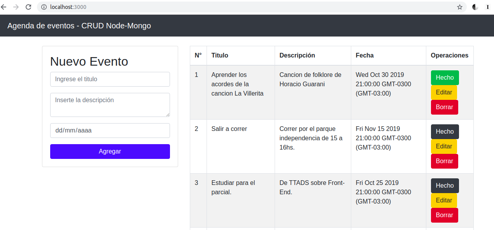

<h1 align="center">
  
</h1>
<h5 align="center">Universidad Tecnologica Nacional</h5>

##### Materia: Técnicas y Tecnologías Avanzadas de Desarrollo de Software 2019

# Trabajo practico de Frontend

## Errores para corregir

 * Visualización de fechas.
 * Parsear el formato de fechas de Mongo para que sean compatibles con el <input type="date" value="[documentoMongo.fecha]">
 * Mostrar Ventana modal de confirmacion al usuario cada vez que borra una tarea o confirma la edición de una tarea.
 * Informar con alerts de bootstrap (class="alert alert-success alert-info alert-warning añlert-danger") cuando se crea, edita o elimina una tarea. Actualemente se muestra por consola pero no se le informa al usuario.
 * En caso de alguna falla de una ruta, codigo, etc, mostrar un 404 y redireccionar a pagina principal. 

### Levantar servidor desde consola:
```
 git clone https://github.com/nicomateucci/ttads-tp-backend
 cd ttads-tp-backend
 node src/server.js
 http://localhost:3000/api/tareas (En el navegador) 
```

## REST API

 * Para iniciar la plicación, se debe ejecutar con NodeJS el archivo **src/server.js**

Peticion | Ruta | Descripción
--|--|--
 GET  | /api/tareas | Pagina principal.
 POST  | /api/tareas | Nueva tarea.
 GET   | /api/tareas/:id | Encontrar tarea con su id.
 PUT   | /api/tareas/:id | Modificar una tarea existente.
 DELETE | /api/tareas/:id | Eliminar una tarea.
 GET | /api/tareas/:id/completada | Cambiar tarea a estado "COMPLETADA".

## Alcance

### Funcionalidad

 * La aplicación se trata de una agenda de tareas. Cada tarea tiene los atributos:
 	* **titulo**, tipo String.
  	* **descripcion**, tipo String.
   	* **fecha**, tipo Date.
   	* **estado**, tipo Boolean.
 * Desde la pagina principal, el usuario puede agregar una nueva tarea, modificar una existente o eliminarla.
 * En caso de haber completado una tarea, el usuario tiene la opcion de cambiarla al estado "COMPLETADA".
 * Cada vez que el usuario ingresa a la pagina principal, en ella se mostrar la lista de tareas existentes, con sus respectivos atributos y opciones para editar, eliminar o establecerla como completada.
 * La aplicación cuenta con 5 componenetes para su front-end:
    * Buscador
    * Barra de Navegación
    * Lista de Tareas
    * Agregar Tarea
    * Editar Tarea 

### Desarrollo

 * La API esta desarrollada con un backend utilizando API REST y un frontend con el framework Angular.
 * El backend esta programado en **JavaScript** con **NodeJS**.
 * Utiliza el framework/middleware **express** para la configuración basica de la aplicación.
 * La persistencia se realiza utilizando el ODM **Mongoose** con una base de datos **MongoDB**.

### Captura de la aplicación

<h1 align="center">
  
</h1>
<h5 align="center">Aplicación corriendo</h5>

## Entorno 🛠️

* **Node.js v10.16.3**
    * Express
    * Hotnode
    * Mongoose
    * Body Parser
    * Method-override
    * Morgan
    * Cors
* **Node Package Manager NPM v6.9.0**
* **MongoDB v4**
    * Mongoose
* **Angular v8.2.2**
* **Bootstrap v4**


## Angular 🚀

[Pagina Oficial ⚡️](https://angular.io/start) - Framework front-end
### Agregar Angular como dependencia al proyecto 🔧

```
npm install -g @angular/cli
```

### Crear proyecto y desplegarlo
```
ng new my-app
cd my-app
ng serve –open
```

_The - -open (or just -o) option automatically opens your browser to http:/localhost:4200._


#### Agregar un nuevo componente "heroes" en angular 🔧
```
ng generate component heroes
```


## Autor

* **Nicolas Mateucci** - *Trabajo Practico TTADS Frontend* - [Github oficial ⚡️](https://github.com/nicomateucci)

--------------------------------------------------------

### Plantillas README

[Ejemplos **muy buenos** de uso de Markdown Langauge](https://github.com/ricval/Documentacion/blob/master/Guias/GitHub/mastering-markdown.md#ejemplos)

[Modelo de plantilla para hacer un buen README ⚡️](https://gist.github.com/Villanuevand/6386899f70346d4580c723232524d35a)


🚀 📋 📦 🛠️ 📄 🎁 📢 🍺 🤓 🔧
